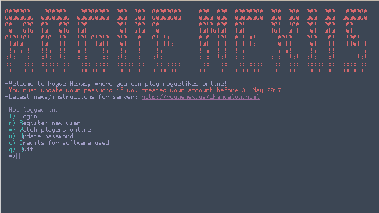

# dotfiles

My personal dotfiles, aka config files for my daily drivers. I'm mainly sharing aesthetic ones, or things I might use when reinstalling linux. 

{:height="480px" width="768px"}

## WM
This might be useful for you if you use, [Bspwm](https://github.com/baskerville/bspwm) tiling window manager, and want guidance on setting up [lemonbar](https://github.com/LemonBoy/bar).

Install lemonbar, either from source or AUR. Copy the panel directory to .config, and add it to your path.

For transparent preselection colors in BSPWM, I recommend compton.

## Terminal

Terminal font used is gohufont, it's bitmap. I use rxvt-unicode. 

{:height="480px" width="768px"}

## Firefox
In addition to that, I have some customized Firefox userchrome.css files, that were based on [twily's](http://twily.info/) comprehensive edits. I had to make some edits to fix some issues his configs had with later versions of Firefox (50+). This, however, made things a bit uglier.

{:height="434px" width="766px"}

